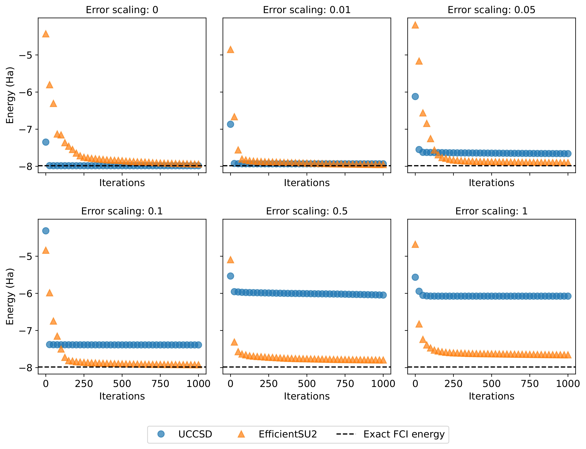

# vqe-project: UCCSD vs EfficientSU2

---

### 📖 Overview


vqe-project is the result of a project in Prof Vincenzo Savona's Quantum Compouting course. The goal was to study ansatz performance under depolarizing noise for a physically-motivated ansatz, UCCSD, and a hardware-efficient ansatz, EfficientSU2. It used the Qiskit 

---

### 🛠 Installation

Prerequisites:

* [Qiskit](https://github.com/Qiskit/qiskit) (1.4.3)
* [Qiskit-aer](https://github.com/Qiskit/qiskit-aer) (0.17.2)
* [Qiskit-algorithms](https://github.com/qiskit-community/qiskit-algorithms) (0.4.0)
* [Qiskit-nature](https://github.com/qiskit-community/qiskit-nature) (0.7.2)


```
# Clone the repository
git clone https://github.com/tjobin/vqe-project.git
cd vqe-project

# Install dependencies
pip install -r requirements.txt
```

---

### 🚀 Usage

#### Create appropriate folders

```
# Create folder for data and log files:
mkdir data_log

# Create folder for figures
mkdir plots
```
#### Set up the simulation in main.py

- Define the molecule of interest with the different parameters
- Define the optimizer (only SPSA available)
- Define the estimator (StatevectorEstimator or AerEstimator)
- Define the VQE simulation with the parameters
- Run VQE with run_vqe_simulation(...)

---

### 📊 Results

Discovered that EfficientSU2 is significantly more robust to gate errors (up to 1% error rate) than the physically motivated UCCSD, despite UCCSD's superior theoretical convergence rate.

<p align="center">
  
  


